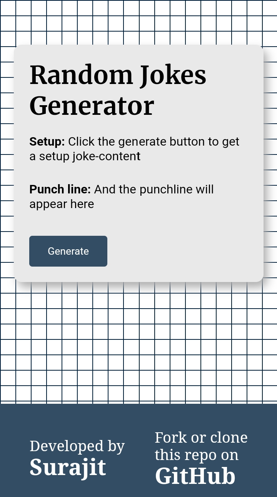

# Random Jokes Generator

Welcome to the **Random Jokes Generator**! This is a simple web application that generates random jokes every time you click a button. Built using **HTML**, **CSS**, and **JavaScript**, this project is designed to bring some fun and humor to your day!

---

## 🎉 Features

- **Random Joke Generator**: Get a fresh, random joke with every click.
- **Simple and Clean Design**: Beautiful and user-friendly interface.
- **Fast and Responsive**: Works seamlessly on both desktop and mobile devices.

---

## 🛠️ Technologies Used

- **HTML**: Used to create the structure of the page.
- **CSS**: For styling and making the design look appealing.
- **JavaScript**: To fetch jokes and handle user interactions.

---

## 🚀 Getting Started

To get started with this project, simply follow these steps:

1. **Clone the repository** to your local machine.

   ```bash
   git clone https://github.com/surajit20107/random-jokes.git
   ```

2. **Navigate to the project folder**.

   ```bash
   cd random-jokes-generator
   ```

3. Open the `index.html` file in your browser to start using the Random Jokes Generator.

---

## 🎨 Demo

Check out the live demo [here](https://random-jokes-red.vercel.app/)

---

## 📸 Screenshot



---

## 🔧 How It Works

1. The **HTML** provides the basic structure, including the container where the jokes will be displayed and the button to trigger the joke fetch.
2. **CSS** ensures that the layout is visually appealing and responsive across devices.
3. **JavaScript** pulls random jokes from an API or pre-defined list and updates the webpage with a new joke when the button is clicked.

---

## 📄 License

This project is licensed under the MIT License - see the [LICENSE](LICENSE) file for details.

---

## 🤝 Contributing

If you'd like to contribute to this project, feel free to fork the repository and submit pull requests. Whether it's fixing a bug, improving the design, or adding more features, all contributions are welcome!

---

## 🙋‍♂️ Author

Created with ❤️ by [Surajit](https://github.com/surajit20107).

---

## 💬 Feedback

If you have any feedback or encounter issues, please open an issue or send a pull request. Let's keep this project fun and bug-free!

---

Enjoy the jokes and share them with your friends! 😄

---

